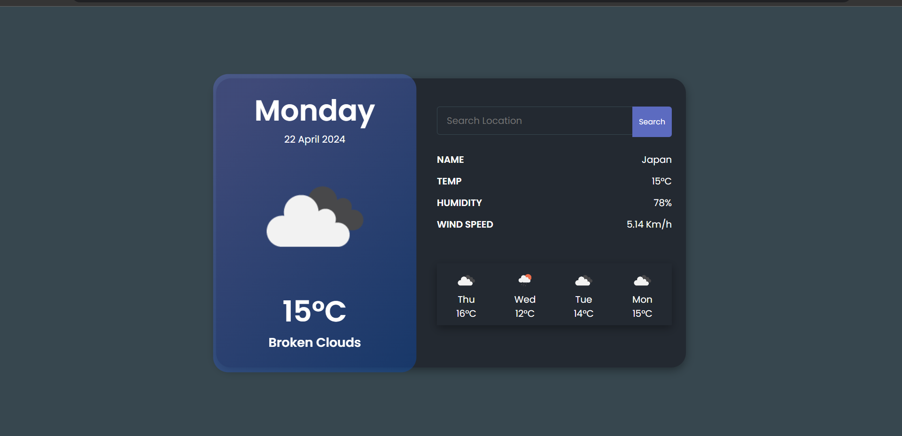

<h1>In script.js file, you’ll use JavaScript to fetch weather data from a weather API. For this example, we’ll use the OpenWeatherMap API. You’ll need to sign up for a free API key at OpenWeatherMap to use their service.</h1>
<h1>Open your index.html file in a web browser, and you should have a basic weather app that allows users to input a location and fetch weather data from the OpenWeatherMap API.Remember to replace 'YOUR_API_KEY' it with your actual API key from OpenWeatherMap.</h1>