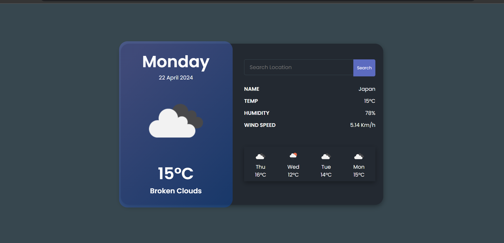

# 🌤️ ForeCastify

> A lightweight, framework-free weather application delivering real-time conditions and multi-day forecasts through a clean, responsive interface.

<p align="center">
  
</p>

<p align="center">
  
  
  
  
</p>

---

## 📖 Overview

ForeCastify is a client-side weather dashboard built with **vanilla JavaScript** — no framework overhead, no build step. It demonstrates core front-end engineering fundamentals: asynchronous API integration, DOM manipulation, and responsive UI design, all in a dependency-light codebase.

The app fetches live weather data via the **OpenWeatherMap API** and renders current conditions alongside a scrollable multi-day forecast, with location search handled entirely client-side.

## ✨ Features

- 🔍 **Location Search** — Look up weather for any city via a simple search input
- 🌡️ **Live Conditions Card** — Displays current temperature, weather description, humidity, and wind speed
- 📅 **Multi-Day Forecast Strip** — Horizontally scrollable forecast list with per-day icons and temperatures
- 🎨 **Dynamic Weather Icons** — Condition-based icons rendered directly from the OpenWeatherMap icon set
- 📱 **Responsive Layout** — Adapts cleanly across desktop and mobile viewports
- ⚡ **Zero Build Tooling** — Pure HTML/CSS/JS; runs directly in the browser, no bundler required

## 🏗️ Architecture

## 📁 Project Structure

```
ForeCastify/
├── index.html      # Markup — layout, search form, weather card, forecast list
├── Style.css        # Styling — responsive layout, card design, iconography
├── Script.js         # Logic — API calls, DOM updates, event handling
└── preview.png       # App preview screenshot
```
**Design approach:** UI and logic are intentionally decoupled — `index.html` defines static structure and placeholder elements, while `Script.js` owns all dynamic behavior (fetching data and updating the DOM). This keeps the codebase easy to reason about without a templating layer.

## 🛠️ Tech Stack

| Layer | Technology |
|---|---|
| Structure | HTML5 |
| Styling | CSS3 (Flexbox-based responsive layout) |
| Logic | Vanilla JavaScript (ES6+, Fetch API) |
| Data Source | OpenWeatherMap API |

## 🚀 Getting Started

```bash
# Clone the repository
git clone https://github.com/samirsinghkshatriya/ForeCastify.git
cd ForeCastify

# Open directly in browser
open index.html
```

> Requires a valid [OpenWeatherMap API key](https://openweathermap.org/api) — add it in `Script.js` before running.

## 🔮 Potential Enhancements

- [ ] Geolocation-based auto-detect for user's current city
- [ ] Unit toggle (°C / °F)
- [ ] Error handling & loading states for failed/slow API calls
- [ ] LocalStorage caching to reduce redundant API calls
- [ ] Migrate to a component-based framework (React) for state management at scale

---
